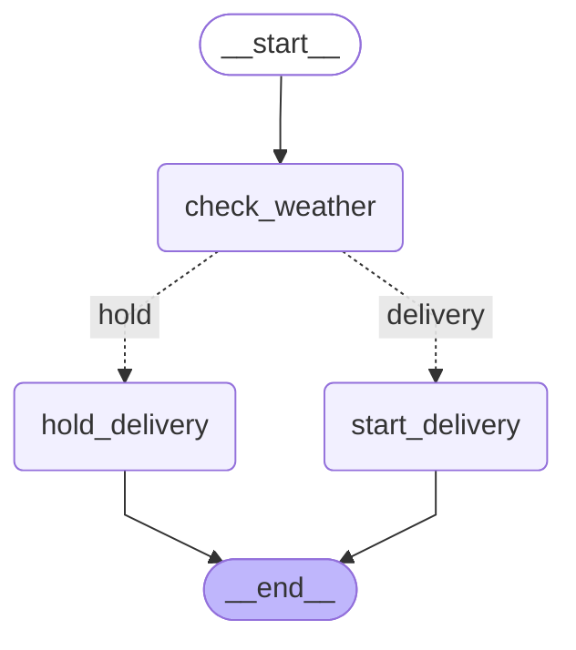

# delivery_plan

```mermaid
---
config:
  flowchart:
    curve: linear
---
graph TD;
	__start__([<p>__start__</p>]):::first
	check_weather(check_weather)
	start_delivery(start_delivery)
	hold_delivery(hold_delivery)
	__end__([<p>__end__</p>]):::last
	__start__ --> check_weather;
	check_weather -. &nbsp;hold&nbsp; .-> hold_delivery;
	check_weather -. &nbsp;delivery&nbsp; .-> start_delivery;
	hold_delivery --> __end__;
	start_delivery --> __end__;
	classDef default fill:#f2f0ff,line-height:1.2
	classDef first fill-opacity:0
	classDef last fill:#bfb6fc

```
